# WriteYourOwn

<p align="center">
  
</p>

WriteYourOwn is a Django writing platform built around one clear loop: authenticate, write, organize, measure, and ship content. The project uses a custom email-first user model, article ownership rules, automatic word counting, search, and production-friendly deployment settings.

## Workflow-First Overview

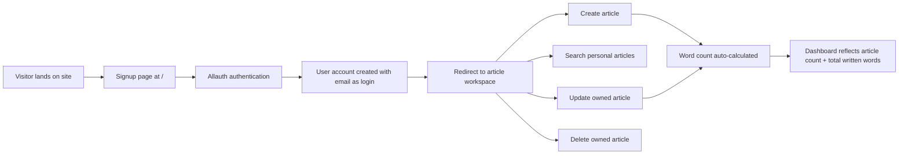

WriteYourOwn is designed as a personal writing workspace, not a public publishing feed. Every major flow is centered on the authenticated user and their own article set.

## Application Workflow

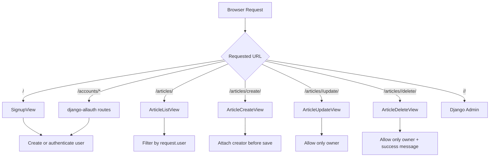

The routing strategy is intentionally simple: authentication is front-loaded, article actions live under `/articles/`, and the admin path is environment-controlled through `ADMIN_URL`.

## Authentication and Access Control Workflow

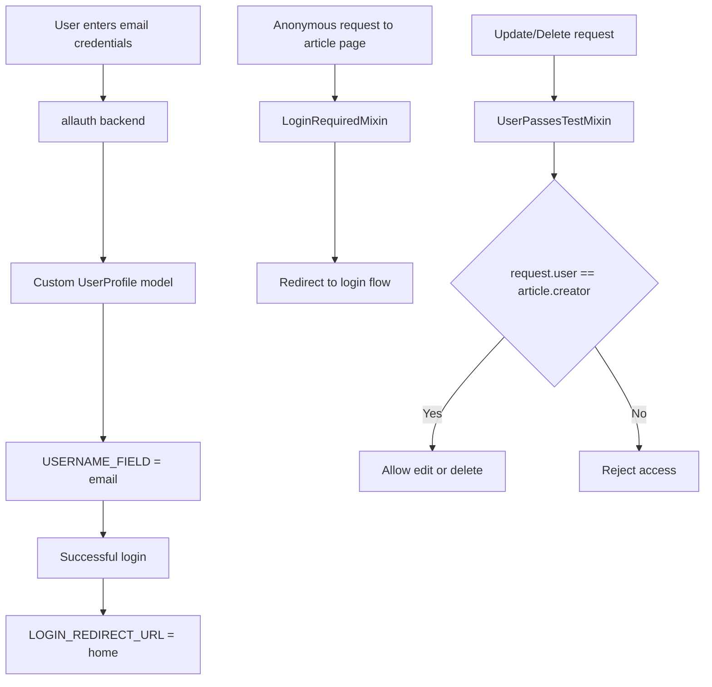

Theory: the project combines `django-allauth` with a custom `AbstractUser` extension so email becomes the primary identity. Authorization is then enforced at the view layer, especially for update and delete actions.

## Article Lifecycle Workflow

```mermaid
flowchart LR
    A[Writer opens create form] --> B[Enter title, status, content, twitter_post]
    B --> C[Submit CreateView]
    C --> D[creator = current user]
    D --> E[Article save method]
    E --> F[Strip HTML-like tags from content]
    F --> G[Count words with regex]
    G --> H[Persist article]
    H --> I[Redirect to article list]
    I --> J[Paginated personal dashboard]
```

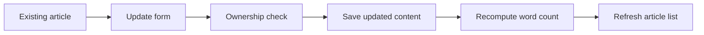

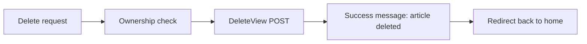

Theory: the article model is optimized for a writer's working draft cycle. Status tracks writing progress, and `word_count` is derived automatically so metrics stay consistent without manual input.

## Search and Dashboard Workflow

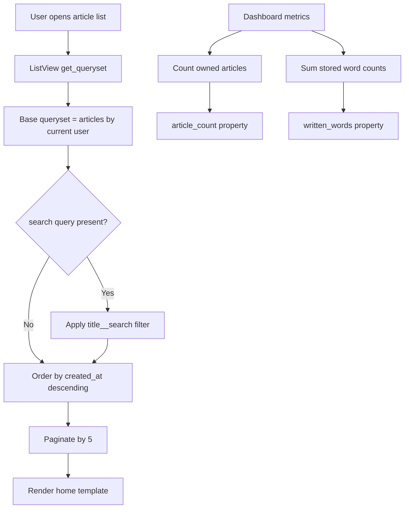

Theory: the dashboard is private by design. Search only inspects the current user's articles, and model properties expose lightweight productivity metrics directly from relational data.

## Configuration Workflow

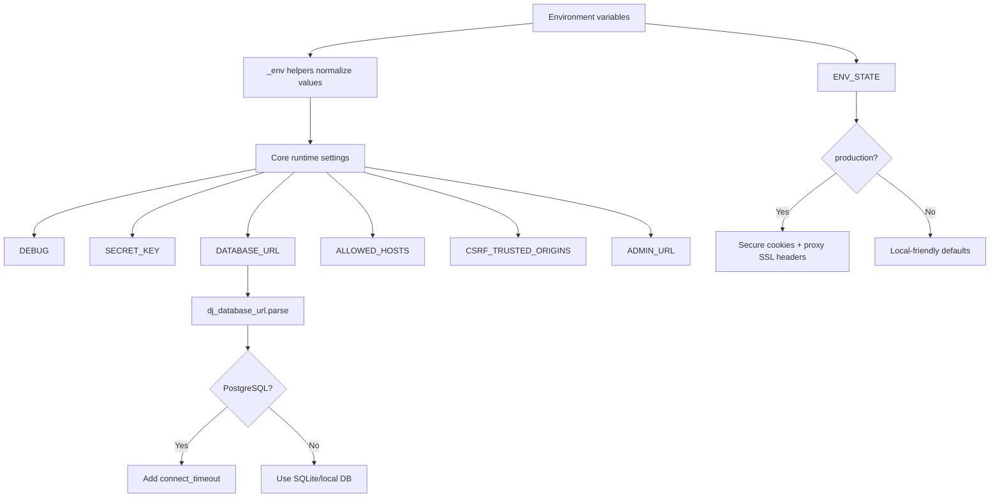

Theory: settings are built around environment-first deployment. Local development stays fast, while production enables stricter cookie, proxy, and host handling without needing a separate settings module.

## Email Delivery Workflow

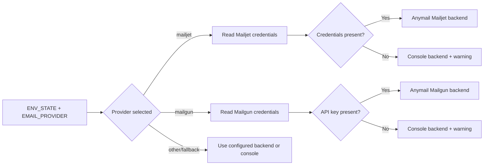

Theory: the email setup is failure-aware. If production credentials are incomplete, the app falls back to console email instead of crashing silently, making misconfiguration easier to spot.

## Delivery Workflow

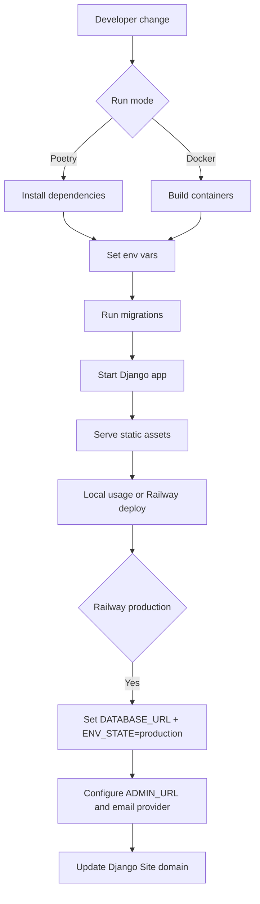

## Project Map

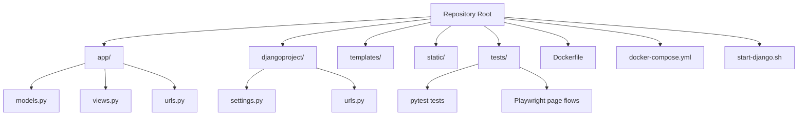

## Quick Start

### Poetry path

```bash
git clone https://github.com/Harshpreet1729/WriteYourOwn.git
cd WriteYourOwn
poetry install
poetry run python manage.py migrate
poetry run python manage.py runserver
```

### Docker path

```bash
docker compose up --build
```

App URL: `http://127.0.0.1:8000`

## Minimum Environment Variables

```env
ENV_STATE=dev
DEBUG=True
SECRET_KEY=change-me
DATABASE_URL=sqlite:///db.sqlite3
ALLOWED_HOSTS=127.0.0.1,localhost
ADMIN_URL=admin
```

## Test Workflow

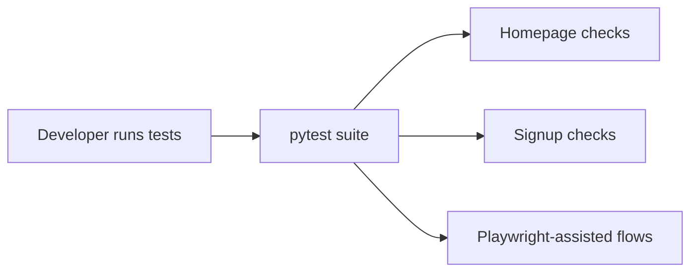

Run:

```bash
poetry run pytest
```

Install Playwright browsers if needed:

```bash
poetry run playwright install --with-deps
```

## Common Notes

- Search uses PostgreSQL full-text search on article titles.
- Static files are served with WhiteNoise.
- The admin URL is intentionally customizable.
- Production uses secure cookie and proxy-aware settings when `ENV_STATE=production`.

## Author

Harshpreet1729
